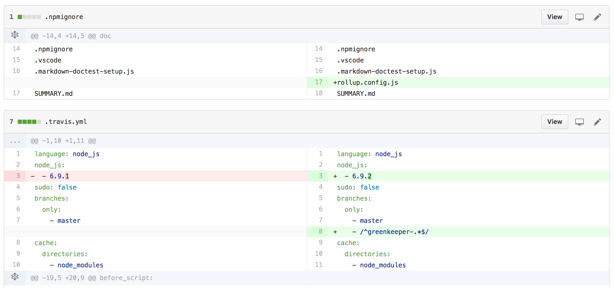

[](https://www.npmjs.com/package/npm-template-sync)
[](https://greenkeeper.io/)
[](https://github.com/arlac77/npm-template-sync)
[](https://github.com/prettier/prettier)
[](http://travis-ci.org/arlac77/npm-template-sync)
[](https://www.bithound.io/github/arlac77/npm-template-sync)
[](http://codecov.io/github/arlac77/npm-template-sync?branch=master)
[](https://coveralls.io/r/arlac77/npm-template-sync)
[](https://snyk.io/test/github/arlac77/npm-template-sync)
[](https://github.com/arlac77/npm-template-sync/issues)
[](http://waffle.io/arlac77/npm-template-sync)
[](https://david-dm.org/arlac77/npm-template-sync)
[](https://david-dm.org/arlac77/npm-template-sync#info=devDependencies)
[](http://inch-ci.org/github/arlac77/npm-template-sync)
[](https://github.com/sindresorhus/xo)
[](https://npmjs.org/package/npm-template-sync)
[](http://commitizen.github.io/cz-cli/)

## npm-template-sync

Keep npm package in sync with its template

```shell
npm-template-sync --template aTemplateGithubUser/aRepo myGithubUser/myRepo
```

merges contents from template repo into destination repo handling some special cases for:

-   Licenses - rewriting license years
-   line set files like .npmignore and .gitignore - by merging both sets together
-   package.json - merge devDependencies, engines and scripts
-   rollup.conf.js - copy / rewrite



## Some templates

-   [list by _npm-package-template_ keyword](https://www.npmjs.com/browse/keyword/npm-package-template)
-   [arlac77 npm-package-template](https://github.com/arlac77/npm-package-template) _rollup_ _ava_
-   [Kronos-Tools npm-package-template](https://github.com/Kronos-Tools/npm-package-template) _mocha_
-   [Kronos-Tools npm-package-template-minimal](https://github.com/Kronos-Tools/npm-package-template-minimal)

# API

<!-- Generated by documentation.js. Update this documentation by updating the source code. -->

### Table of Contents

-   [npmTemplateSync](#npmtemplatesync)
-   [Context](#context)
    -   [usedDevModules](#useddevmodules)
-   [Readme](#readme)
-   [File](#file)
-   [templateOptions](#templateoptions)
-   [sortedKeys](#sortedkeys)
-   [Package](#package)
    -   [properties](#properties)
-   [MergeAndRemoveLineSet](#mergeandremovelineset)
-   [ReplaceIfEmpty](#replaceifempty)
-   [Replace](#replace)

## npmTemplateSync

**Parameters**

-   `provider` **RepositoryProvider** 
-   `targetBranch` **Branch** 
-   `templateBranch` **Branch** 
-   `options` **[Object](https://developer.mozilla.org/docs/Web/JavaScript/Reference/Global_Objects/Object)** 

Returns **[Promise](https://developer.mozilla.org/docs/Web/JavaScript/Reference/Global_Objects/Promise)&lt;PullRequest>** 

## Context

**Parameters**

-   `targetBranch` **Branch** 
-   `templateBranch` **Branch** 
-   `properties` **[Object](https://developer.mozilla.org/docs/Web/JavaScript/Reference/Global_Objects/Object)** 
-   `options` **[Object](https://developer.mozilla.org/docs/Web/JavaScript/Reference/Global_Objects/Object)** 

**Properties**

-   `targetBranch` **Branch** 
-   `templateBranch` **Branch** 
-   `properties` **[Object](https://developer.mozilla.org/docs/Web/JavaScript/Reference/Global_Objects/Object)** 
-   `options` **[Object](https://developer.mozilla.org/docs/Web/JavaScript/Reference/Global_Objects/Object)** 

### usedDevModules

all used dev modules

Returns **[Set](https://developer.mozilla.org/docs/Web/JavaScript/Reference/Global_Objects/Set)&lt;[string](https://developer.mozilla.org/docs/Web/JavaScript/Reference/Global_Objects/String)>** 

## Readme

**Extends File**

injects badges into REAMDE.md

## File

**Parameters**

-   `path` **[string](https://developer.mozilla.org/docs/Web/JavaScript/Reference/Global_Objects/String)** 
-   `options` **[Object](https://developer.mozilla.org/docs/Web/JavaScript/Reference/Global_Objects/Object)**  (optional, default `{}`)

**Properties**

-   `path` **[string](https://developer.mozilla.org/docs/Web/JavaScript/Reference/Global_Objects/String)** 
-   `options` **[Object](https://developer.mozilla.org/docs/Web/JavaScript/Reference/Global_Objects/Object)** 

## templateOptions

find merger options in the template section of a package.json

**Parameters**

-   `json` **[Object](https://developer.mozilla.org/docs/Web/JavaScript/Reference/Global_Objects/Object)** 
-   `name` **[string](https://developer.mozilla.org/docs/Web/JavaScript/Reference/Global_Objects/String)** 

Returns **[Object](https://developer.mozilla.org/docs/Web/JavaScript/Reference/Global_Objects/Object)** 

## sortedKeys

order in which json keys are written

## Package

**Extends File**

Merger for package.json

### properties

Deliver some key properties

**Parameters**

-   `context` **[Context](#context)** 

Returns **[Object](https://developer.mozilla.org/docs/Web/JavaScript/Reference/Global_Objects/Object)** 

## MergeAndRemoveLineSet

**Extends MergeLineSet**

## ReplaceIfEmpty

**Extends File**

Overwrites none existing file from template

## Replace

**Extends File**

Replace file from template (always)

# install

With [npm](http://npmjs.org) do:

```shell
npm install -g npm-template-sync

# npm-template-sync --help
```

# license

BSD-2-Clause
